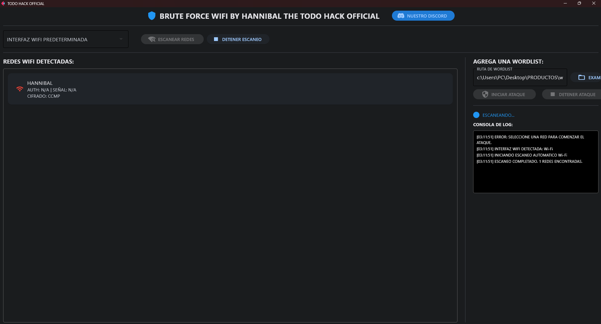
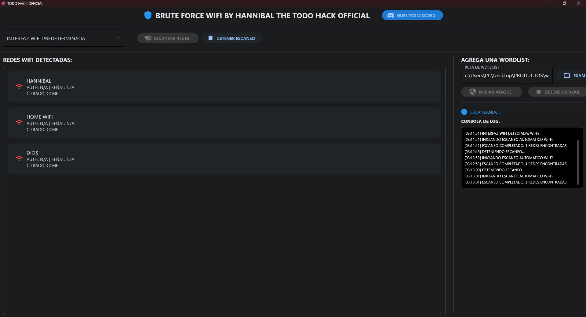
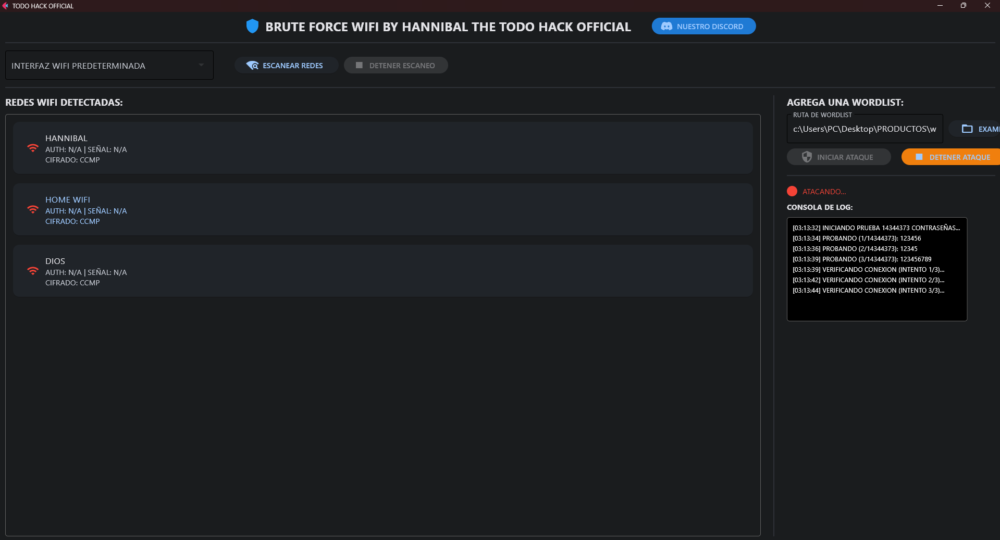
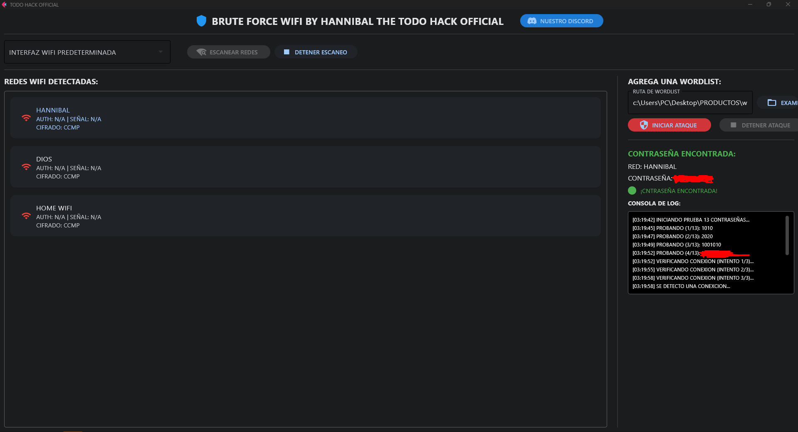

# BRUTE FORCE WIFI - TODO HACK OFFICIAL

[](https://discord.gg/4svwzsy3UP)
[](https://www.youtube.com/@HANNIBAL_H4X)
[](https://www.youtube.com/@HANNIBAL_H4X)

Una herramienta de auditoría WiFi con interfaz gráfica para pruebas de penetración en redes inalámbricas.



## 🚀 Características

- Interfaz grafica diseñada en flet usando python
- Detección automática de interfaces WiFi
- Escaneo de redes en tiempo real
- Ataque con diccionario (brute force) para redes WPA/WPA2
- Consola de logs integrada para ver mas a detalles el proseso
- Detección automática cual es la contraseña correcta y te conecta a la red wifi

## 📋 Requisitos

- Windows 10/11
- Python 3.8 o superior a esta version
- Privilegios de administrador

## ⚙️ Instalación

1. Clona este repositorio:
```bash
git clone https://github.com/tu-usuario/brute-force-wifi.git
cd brute-force-wifi
```

2. Instala las dependencias:
```bash
pip install -r requirements.txt
```

## 🔧 Uso

1. Ejecuta el cmd como administrador:
```bash
python.exe BRUTE-FORCE-WIFI.py
```
2. Ejecucion en kali terminal como administrador:
```bash
python BRUTE-FORCE-WIFI.py
```
2. La herramienta detectará automáticamente tu interfaz WiFi
3. Presiona "ESCANEAR REDES" para ver las redes disponibles
4. Selecciona una red de la lista
5. Elige tu archivo wordlist
6. Presiona "INICIAR ATAQUE" para comenzar

## 📸 Capturas de Pantalla








## ⚠️ Aviso Legal

Esta herramienta está diseñada únicamente con fines educativos y de pruebas en redes propias. No me hago responsable del mal uso de esta herramienta.

## 🔗 Enlaces

- [Discord](https://discord.gg/4svwzsy3UP)
- [Canal de YouTube](https://www.youtube.com/@HANNIBAL_H4X)
